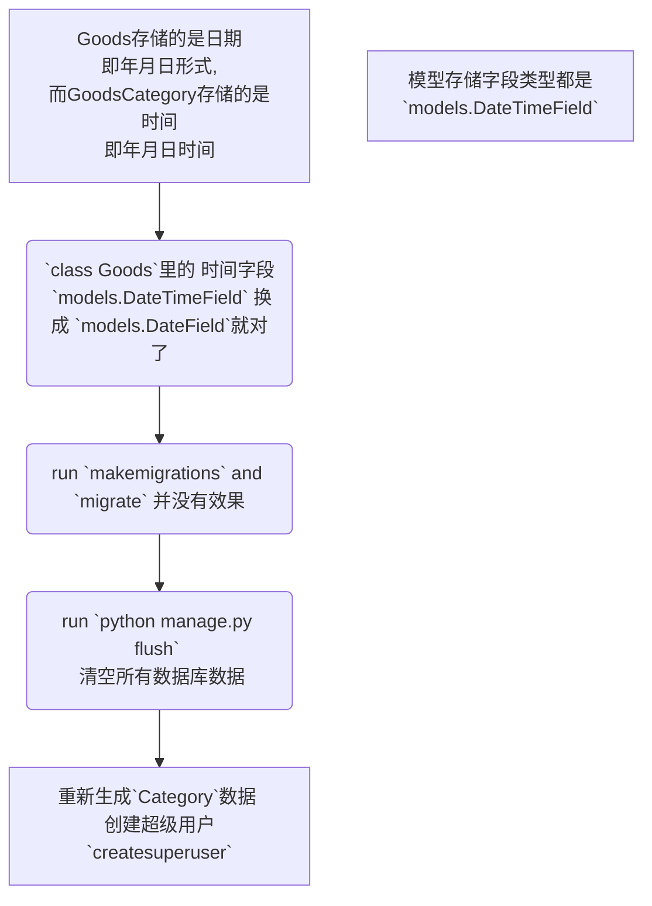

# study_django_backend
学习Django后端接口

> 使用Django和Vue开发一个生鲜电商平台，采用前后端分离技术实现。

# 安装环境依赖
在克隆或下载项目后，在项目目录下执行`pip install -r requirements.txt`命令安装项目所需库。

# Django xadmin数据迁移 记录报错
## 问题一
```sh
ImportError: cannot import name 'python_2_unicode_compatible' from 'django.utils.encoding'
```
### 解决方式：
```diff
- # from django.utils.encoding import python_2_unicode_compatible, smart_text
+ from six import python_2_unicode_compatible
+ from django.utils.encoding import smart_str
```

## 问题二
```sh
ImportError: cannot import name 'pretty_name' from 'django.forms.forms'
```
### 解决方式
直接注释这一句

## 问题三
```sh
ImportError: cannot import name 'force_text' from 'django.utils.encoding'
```
### 解决方式
```diff
- from django.utils.encoding import force_text, smart_text, smart_str
+ from django.utils.encoding import force_str, smart_str
```

## 问题四
```sh
ImportError: cannot import name 'ungettext' from 'django.utils.translation'
```
### 解决方式
```diff
- # from django.utils.translation import ungettext
+ from django.utils.translation import ngettext
```

## 问题五
```sh
ModuleNotFoundError: No module named 'django.contrib.staticfiles.templatetags'
```
### 解决方式
```diff
- # from django.contrib.staticfiles.templatetags.staticfiles import static
+ from django.templatetags.static import static
```

## 问题六
```sh
ImportError: cannot import name 'ugettext' from 'django.utils.translation'

or

ImportError: cannot import name 'ugettext_lazy' from 'django.utils.translation'
```
### 解决方式
分析：
Django已经弃用 ugettext(), ugettext_lazy(), ugettext_noop(), ungettext(), 和 ungettext_lazy()
查看[issues地址](https://www.yii666.com/blog/401684.html)

解决办法：
既然选择了高版本Django，就尝试在此版本下解决问题。

它已从Django 4中删除，请使用此选项
from django.utils.translation import gettext_lazy as _

```diff
- #from django.utils.translation import ugettext as _
+ from django.utils.translation import gettext as _
```

## 问题七
```sh
ImportError: cannot import name 'urlquote' from 'django.utils.http'
```

### 解决方式
dashboard.py文件
```diff
- # from django.utils.http import urlencode, urlquote
+ from django.utils.http import urlencode, quote
```

## 问题八
```sh
ImportError: cannot import name 'ungettext' from 'django.utils.translation'
```

### 解决方式
```diff
- from django.utils.translation import gettext as _, ungettext
+ from django.utils.translation import gettext as _, ngettext
```

## 问题九
```sh
ImportError: cannot import name 'lookup_needs_distinct' from 'django.contrib.admin.utils'
```

### 解决方式
```diff
- from django.contrib.admin.utils import get_fields_from_path, lookup_needs_distinct
+ from django.contrib.admin.utils import get_fields_from_path, lookup_spawns_duplicates
```

## 问题十
```sh
ImportError: cannot import name 'FieldDoesNotExist' from 'django.db.models.fields'
```
### 解决方式
先`pip install django-advanced-filters`
```diff
- # from django.db.models.fields import FieldDoesNotExist
+ from django.core.exceptions import FieldDoesNotExist
```

## 问题十一
```sh
ImportError: cannot import name 'FieldDoesNotExist' from 'django.db.models'
```
### 解决方式
```diff
- from django.db.models import FieldDoesNotExist,Avg, Max, Min, Count, Sum

+ from django.db.models import Avg, Max, Min, Count, Sum
+ from django.core.exceptions import FieldDoesNotExist
```

## 问题十二
```sh
ImportError: cannot import name 'SKIP_ADMIN_LOG' from 'import_export.admin'
```

### 解决方式
```diff
from import_export.admin import DEFAULT_FORMATS, SKIP_ADMIN_LOG, TMP_STORAGE_CLASS
from import_export.admin import DEFAULT_FORMATS, ImportMixin, ImportExportMixinBase
```

# 对xadmin配置访问路径 记录报错
## 问题一
```sh
AttributeError: 'Options' object has no attribute 'installed'
```
### 解决方式
我还研究了很久啥原因，看了看源码，后来直接看这段代码的意思，就是让把django.contrib.contenttypes安装到INSTALLED_APPS中，我检查了一下，安装了呀。
解决办法：直接注释掉，当然这样就没有检查安装django.contrib.contenttypes的过程了。

```python
# if not ContentType._meta.installed:
#     raise ImproperlyConfigured("Put 'django.contrib.contenttypes' in "
#                                "your INSTALLED_APPS setting in order to use the admin application.")
```

看源码，Django 2.0.x的源码中Options是有这个属性方法的，3.2.x也有，4.0.x也有。

> /django/db/models/options.py

```py
@property
def installed(self):
    return self.app_config is not None
```

在Django的release note中没有看到提及，看[GitHub的代码历史，是被移除了，说没用](https://github.com/django/django/commit/8e3b1cf098018b4632de63c359ef6d761e92ec04)。

## 问题二
```sh
TypeError: never_cache didn't receive an HttpRequest. If you are decorating a classmethod, be sure to use @method_decorator.
```
### 解决方式
这个exception好像还没解决，[点击这个链接反馈，加速fix](https://fixexception.com/django/never-cache-didn-t-receive-an-httprequest-if-you-are-decorating-a-classmethod-be-sure-to-use-method-decorator/)

我是注释掉了：

```python
        # if not hasattr(request, "META"):
        #     raise TypeError(
        #         "never_cache didn't receive an HttpRequest. If you are "
        #         "decorating a classmethod, be sure to use @method_decorator."
        #     )
```

## 问题三
```sh
raise TemplateSyntaxError(
django.template.exceptions.TemplateSyntaxError: 'crispy_forms_tags' is not a registered tag library. Must be one of:
admin_list
admin_modify
admin_urls
cache
i18n
l10n
log
static
tz
xadmin_tags
```
### 解决方式
在settings.py 加入`crispy_forms`

```diff
INSTALLED_APPS = [
      "django.contrib.admin",
      "django.contrib.auth",
      "django.contrib.contenttypes",
      "django.contrib.sessions",
      "django.contrib.messages",
      "django.contrib.staticfiles",
      "users.apps.UsersConfig",
      # "goods",
      # "trade",
      # "user_operation",
      "goods.apps.GoodsConfig",
      "trade.apps.TradeConfig",
      "user_operation.apps.UserOperationConfig",
      "DjangoUeditor",
      "xadmin",
+     "crispy_forms",
]
```

## 问题四
```sh
django.template.exceptions.TemplateDoesNotExist: bootstrap3/errors.html
```
### 解决方式
这是django高版本与xadmin低版本 不兼容导致的

在xadmin中找到`bootstrap3/errors.html`,可以发现xadmin只有两个页面使用到了`bootstrap3/errors.html`,把他们注释或者删除即可。


把`login.html`页面的第46行注释掉


把`form.html`页面的第19行注释掉


# 点击菜单 记录报错
## 问题一 
```sh
AttributeError: 'WSGIRequest' object has no attribute 'is_ajax'
```
### 解决方式
这个[Django 3.1的release note](https://docs.djangoproject.com/en/3.1/releases/3.1/#id2)有提到

>The HttpRequest.is_ajax() method is deprecated as it relied on a jQuery-specific way of signifying AJAX calls, while current usage tends to use the JavaScript Fetch API. Depending on your use case, you can either write your own AJAX detection method, or use the new HttpRequest.accepts() method if your code depends on the client Accept HTTP header.
If you are writing your own AJAX detection method, request.is_ajax() can be reproduced exactly as request.headers.get(‘x-requested-with’) == ‘XMLHttpRequest’.

可以像这样用，创建一个自定义函数，进行检查：
```python
def is_ajax(request):
    return request.META.get('HTTP_X_REQUESTED_WITH') == 'XMLHttpRequest'

```

网上的例子：
```python
from django.shortcuts import HttpResponse


def is_ajax(request):
    return request.META.get('HTTP_X_REQUESTED_WITH') == 'XMLHttpRequest'


def ajax_test(request):
    if is_ajax(request=request):
        message = "This is ajax"
    else:
        message = "Not ajax"
    return HttpResponse(message)

```

解决方法：
```python
        # return bool(self.request.is_ajax() or self.request.GET.get('_ajax'))
        return bool(self.request.headers.get('x-requested-with') == 'XMLHttpRequest' or self.request.GET.get('_ajax'))
```

## 问题二
```sh
AttributeError: module 'django.db.models' has no attribute 'FieldDoesNotExist'
```

### 解决方式
```python
最上面导包的代码
from django.core.exceptions import PermissionDenied, ObjectDoesNotExist
改成
from django.core.exceptions import PermissionDenied, ObjectDoesNotExist, FieldDoesNotExist

```

```python
报错的那个位置改成
# except models.FieldDoesNotExist:
 except FieldDoesNotExist:

```

## 问题三
```sh
django.template.exceptions.TemplateSyntaxError: Invalid block tag on line 2: 'ifequal'. Did you forget to register or load this tag?
```
### 解决方式
找到报错的模板文件，我报错的是项目根路径/venv/Lib/site-packages/xadmin/templates/xadmin/includes/pagination.html
```python
把ifequal cl.result_count 1 改成 if cl.result_count == 1
把endifequal 改成 endif
```


# `datetime` 用 `json.dumps()`方法序列化 记录报错
## 问题一
```sh
raise TypeError(f'Object of type {o.__class__.__name__} '
TypeError: Object of type date is not JSON serializable
```
### 解决方式
使用Django自带的`model_to_dict()`方法可以实现直接将模型数据转化为字典形式，但是对于DateTimeField、ImageField等字段时还是无法序列化，因此需要使用**serializer**进行序列化，views_base.py如下：

```python
import json

from django.views.generic.base import View
from django.http import HttpResponse, JsonResponse
from django.forms.models import model_to_dict
from django.core import serializers

from goods.models import Goods


class MyEncoder(json.JSONEncoder):
    def default(self, obj):
        if isinstance(obj, bytes):
            return str(obj, encoding='utf-8')

        return json.JSONEncoder.default(self, obj)


class GoodsListView(View):
    def get(self, request):
        '''通过serializers实现商品列表页'''
        goods = Goods.objects.all()[:10]
        json_data = serializers.serialize('json', goods)
        return HttpResponse(json_data, content_type='application/json')

```

# Django配置Restful framework 记录报错
## 问题一
```sh
TypeError: __str__ returned non-string (type NoneType)
```
在Django项目中配置Restful framework时，报错`__str__ returned non-string (type NoneType)`，如下


这可能是自定义用户模型代替Django自带的用户模型时，允许name（或相似的）字段允许为空，例如name = models.CharField(max_length=30, null=True, blank=True, verbose_name='姓名')所以会返回non-string报错，完整模型如下：
```python
class UserProfile(AbstractUser):
    '''用户'''
    name = models.CharField(max_length=30, null=True, blank=True, verbose_name='姓名')
    birthday = models.DateTimeField(null=True, blank=True, verbose_name='出生日期')
    gender = models.CharField(max_length=6, choices=(('male', u'男'), ('female', u'女')), default='female',
                              verbose_name='性别')
    mobile = models.CharField(max_length=11, verbose_name='电话')
    email = models.CharField(max_length=50, null=True, blank=True, verbose_name='邮箱')

    is_delete = models.BooleanField(default=False, verbose_name='是否删除')

    class Meta:
        verbose_name = '用户'
        verbose_name_plural = '用户'

    def __str__(self):
        return self.name

```

### 解决方式
解决办法有2种：

1. 退出admin或xadmin后台登录
   
   退出后台管理登录，操作如下:

   

2. 修改用户模型`__str__()`方法
   因为自定义用户如UserProfile继承自AbstractUser，而AbstractUser模型有username属性，不允许为空，所以可以设置为返回self.username，即如下：

   ```python
   def __str__(self):
    return self.username
   ```
   此时不登出后台管理也可以正常访问。

## 问题二
```sh
AttributeError: 'datetime.date' object has no attribute 'utcoffset'
```
我查看了数据库


明显看出


### 解决方式
> 1. 清空数据库
> 2. 手动更改`good_goods`数据库时间字段，把`date`类型改成`timedate`类型
> 3. 重新生成数据和添加管理员账号


## 问题三
```sh
AssertionError: `basename` argument not specified, and could not automatically determine the name from the viewset, as it does not have a `.queryset` attribute.
```
这个问题是在重写分页的方法之后，在进行URL注册时所报的错。

在views中去掉了queryset属性，改用get_queryset()方法，此时basename这个值必须补充！！


### 解决方式
#### 解决方式一
router注册URL时，补充basename即可。


#### 解决方式二
在重写get_queryset前设置好queryset的默认值

```python
queryset = DeptModel.objects.all()
serializer_class = DeptSerializer
pagination_class = GlobalPagination
```

## 问题四
```sh
django.template.exceptions.TemplateDoesNotExist: django_filters/rest_framework/crispy_form.html
```
### 解决方式
安装应用 `django_filters` 到 settings.py  的 `INSTALLED_APPS`.
```python
INSTALLED_APPS = [
    ...
    "django_filters",
]
```
**注意:`django_filters` 和 `django-filter` 实际上是同一个包的不同名称。`django_filters`是过去版本的包名称，而`django-filter`是当前版本的包名称。**
即 `pip install django-filter` 即可。

## 问题五
```sh
django.template.exceptions.TemplateDoesNotExist: bootstrap3/field.html
```
### 解决方式
在django中引入xadmin后出现数十个报错信息，一步一步解决了大部分，但本文题目中标注的问题无法解决。后来在StackOverFlow找到解决方案

安装crispy-bootstrap3第三方依赖包
```sh
pip install crispy-bootstrap3
```

配置setting.py文件
```python
INSTALLED_APPS = [
...
    'crispy_forms',
    'crispy_bootstrap3',
...
]
...
CRISPY_TEMPLATE_PACK = 'bootstrap3'
```


## 警告一
```sh
norderedObjectListWarning: Pagination may yield inconsistent results with an unordered object_list: <class 'goods.models.Goods'> QuerySet.
```
django启动之后，只要访问页面总是有这样的警告提示：

UnorderedObjectListWarning: Pagination may yield inconsistent results with an unordered object_list

翻译过来：

无序对象列表警告：分页可能会产生与无序对象列表不一致的结果

产生上面警告的原因是：使用了djangorestframe，展示结果为排序造成的

只要我们在视图或者模型上加上排序就可以消除警告

### 解决方法
在view下面加入排序
```diff
-    queryset = Goods.objects.all()
+    queryset = Goods.objects.all().order_by("goods_sn")
```


# 补充 Django REST framework 知识点 记录报错
## 问题一
```sh
AttributeError: 'AutoSchema' object has no attribute 'get_link'
```
### 解决方式
问题一和和二解决：

因为新版的`restframework`需要指定默认`schema``

所以需要在`settings.py`中添加如下代码

```python
REST_FRAMEWORK = {
    'DEFAULT_SCHEMA_CLASS': 'rest_framework.schemas.coreapi.AutoSchema'
}
```

或者配置(**推荐使用**)
```python
REST_FRAMEWORK = {
    'DEFAULT_SCHEMA_CLASS': 'rest_framework.schemas.AutoSchema'
}
```

或者配置如下：
```python
REST_FRAMEWORK = {
    'DEFAULT_SCHEMA_CLASS': 'rest_framework.inspectors.AutoSchema'
}
```

## 问题二
```sh
ImportError: Could not import 'rest_framework.schemas.coreapi.AutoSchema' for API setting 'DEFAULT_SCHEMA_CLASS'. ModuleNotFoundError: No module named 'rest_framework.schemas.coreapi'
```
